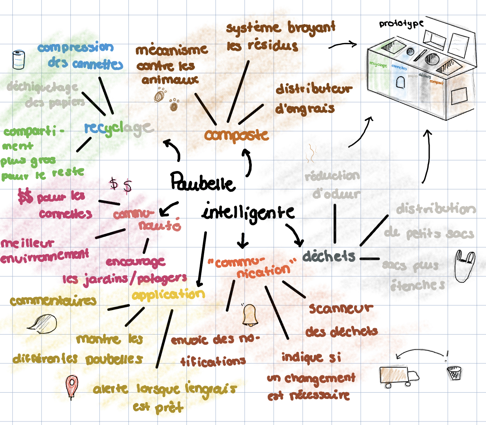
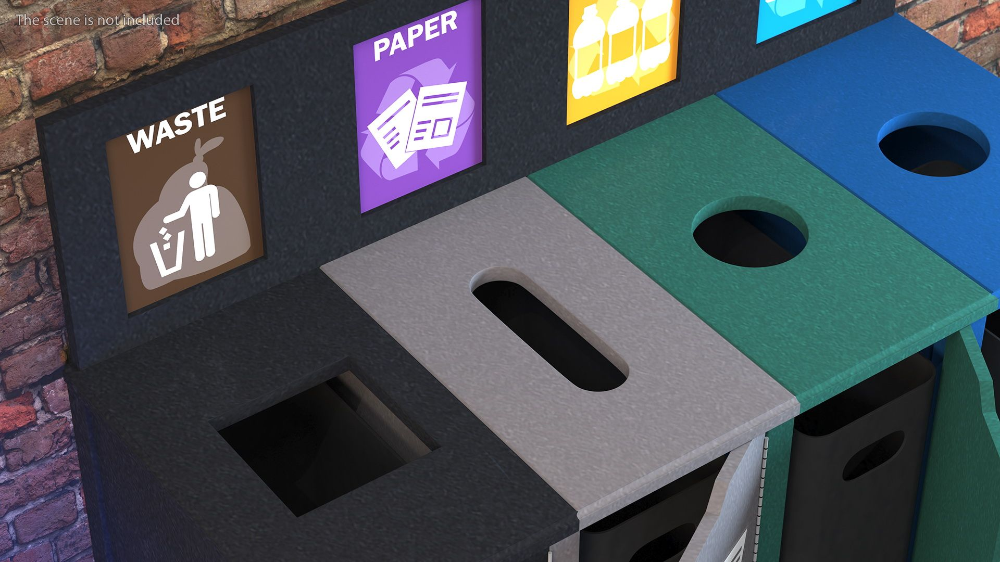
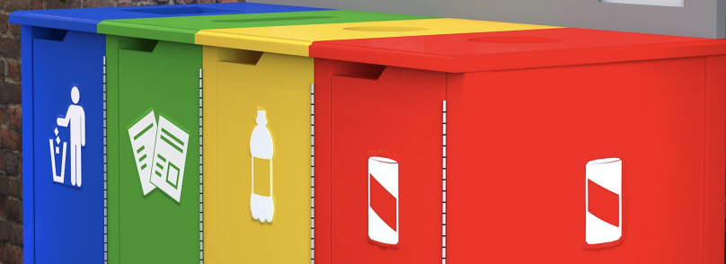
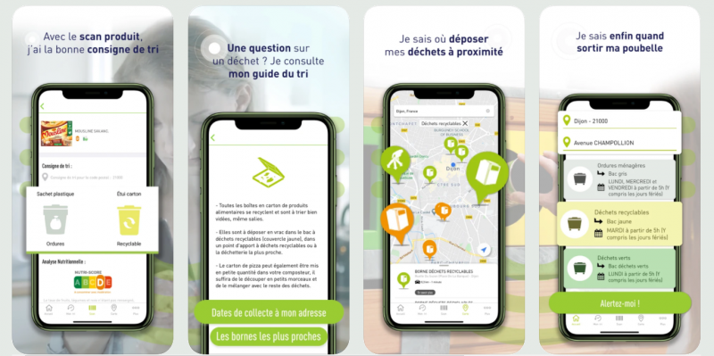

# Entrée 8
## Plan du travail synthèse
Durée: 8 à 10 minutes

### Résumer votre projet en une phrase
Création de poubelles intelligentes qui incitent la population à mieux trier leurs déchets et d'être plus écoresponsable 

### Moodboard
Montrer nous l'allure visuelle et sonore qu'aura votre projet à l'aide d'un moodboard, de maquettes ou de croquis. 

### Technologies
Décrivez quelles seront les technologies utilisées dans votre projet. 

### Tâches
Quelles sont les tâches nécessaires à la réalisation de votre projet? 

